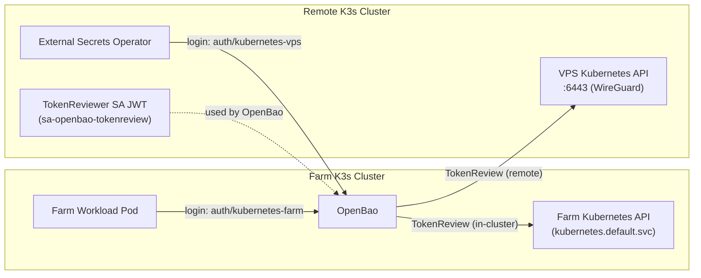

# IaC SecretStore

This repository covers the secrets infrastructure for the **[farm cluster](https://github.com/Schwitzd/GitOps-HomeK3s)** and all remote clusters ([VPS](https://github.com/Schwitzd/IaC-VPSk3s)).

OpenBao provides secret management for all clusters. It runs in **HA Raft mode** and uses **Azure Key Vault (AKV)** for auto-unsealing, meaning nodes can restart without manual intervention. The AKV role assignments and key permissions are provisioned via OpenTofu in accordance with [this tutorial](https://developer.hashicorp.com/vault/tutorials/auto-unseal/autounseal-azure-keyvault).

A one-time **bootstrap Job** (`job-openbao-init`) managed by Argo CD handles the first-run initialisation. The job waits for OpenBao to become responsive, then runs `bao operator init` if the cluster is not yet initialised. Recovery keys and the root token are written to the pod logs and the pod is then automatically removed by a TTL controller to prevent sensitive output from persisting.

## Prerequisites

Inside the `terraform/farm` folder, create a file named `variables_private.tfvars` with the following structure:

```hcl
subscription_id = "<your-subscription-id>"
tenant_id = "<your-tenant-id>"
openbao_address = "<openbao-url>"
```

Inside the `terraform/remote` folder, create a file named `variables_private.tfvars` with the following structure:

```hcl
openbao_address = "<openbao-url>"
```

## Architecture

OpenBao runs in the farm cluster, which is the in-cluster setup. The Kubernetes auth backend for this cluster is created by the OpenBao init job, so OpenTofu does not manage it. Remote clusters authenticate over the network. OpenBao creates their Kubernetes auth backends and configures TokenReview using a reviewer JWT stored in Vault.



> [!NOTE]
> **Why does the VPS cluster need a TokenReviewer SA JWT but the Farm cluster does not?**
> When OpenBao performs a Kubernetes `TokenReview` it must itself authenticate to the target Kubernetes API server. For the Farm cluster (in cluster), OpenBao runs as a pod and Kubernetes automatically mounts a service account token. OpenBao uses that token to call `kubernetes.default.svc` with no extra configuration. For remote clusters, OpenBao has no mounted identity, so it needs a JWT generated in advance (`sa-openbao-tokenreview`) via `kubectl create token` and stored in OpenTofu/Vault. That JWT is what lets OpenBao authenticate to the remote API server and complete the `TokenReview`.

## Deployment

The OpenTofu configuration is split into two independent sub-modules, each with its own state:

- **`terraform/farm/`** — bootstraps the farm cluster: Azure Key Vault auto-unseal, all KV mounts and policies for every cluster, the `remote-clusters` KV mount for IaC operational config, and the ESO auth role for the in-cluster (farm) Kubernetes auth backend.

```mermaid
flowchart LR
    subgraph FARM["Farm K3s Cluster"]
        direction TB
        S1["1. OpenTofu deploys Azure Key Vault for auto-unseal"]
        S2["2. GitOps installs the Secrets Store CSI Driver"]
        S3["3. GitOps installs OpenBao in HA Raft mode"]
        S4["4. Kubernetes Job bootstraps OpenBao (initial config & auth)"]
        S5["5. OpenTofu manages OpenBao structure (engines, policies, roles)"]
        S1 --> S2 --> S3 --> S4 --> S5
    end

    subgraph REMOTES["Remote K3s Clusters"]
        direction TB
        R1["6. GitOps installs the Secrets Store CSI Driver"]
        R2["7. GitOps installs OpenBao in External Mode to deploy CSI Provider (if needed)"]
        R3["8. GitOps installs the External Secrets Operator"]
        R1 --> R2 --> R3
    end

    S5 --> R1
```

- **`terraform/remote/`** — connects remote clusters to farm OpenBao: reads per-cluster auth config from `infrastructure/clusters/<cluster>`, creates the Kubernetes auth backend, configures TokenReview, and creates the ESO role. Run this only after the farm module has been applied and the remote cluster auth config has been stored in OpenBao.



### Azure Key Vault

```sh
# Login on Azure Portal using CLI
az login

# Deploy Azure Key Vault resources
cd terraform/farm
tofu apply --var-file=variables.tfvars --var-file=variables_private.tfvars --target kubernetes_secret_v1.auth_azure_kv
```

### Secrets Store CSI Driver

Using the GitOps repository to deploy [Secrets Store CSI Driver](https://secrets-store-csi-driver.sigs.k8s.io/) on the farm cluster.

### OpenBao

Using the GitOps repository to deploy OpenTofu on the farm cluster. Once it is deployed we have to create the OpenBao structure:

```sh
tofu apply --var-file=variables.tfvars --var-file=variables_private.tfvars --target=terraform_data.openbao_structure
```

### ESO

Using the GitOps repository deploy OpenTofu on the farm cluster.

### Remote clusters

1. Deploy a dedicated ServiceAccount with `system:auth-delegator` permissions on the remote cluster so OpenBao can perform Kubernetes TokenReview operations to validate workload JWTs.

    ```yaml
    ---
    apiVersion: v1
    kind: ServiceAccount
    metadata:
      name: sa-openbao-tokenreview
      namespace: secrets
    ---
    apiVersion: rbac.authorization.k8s.io/v1
    kind: ClusterRoleBinding
    metadata:
      name: crb-openbao-tokenreview
    roleRef:
      apiGroup: rbac.authorization.k8s.io
      kind: ClusterRole
      name: system:auth-delegator
    subjects:
      - kind: ServiceAccount
        name: sa-openbao-tokenreview
        namespace: secrets
    ```

1. Mint a long-lived JWT using the Kubernetes TokenRequest API. OpenBao will use this token to authenticate to the remote cluster’s Kubernetes API when performing TokenReview operations.

    ```sh
    kubectl -n secrets create token sa-openbao-tokenreview --duration=8760h
    ```

1. Store the minted token alongside the cluster CA certificate and API URL in OpenBao at `remote-clusters/<cluster>`.

    ```sh
    bao kv put remote-clusters/vps \
      url="https://<vps-api-server>:6443" \
      ca_cert="<base64-pem-ca>" \
      reviewer_jwt="<token-from-step-2>"
    ```

1. Apply the remote Terraform module to create the `kubernetes-<cluster>` auth backend in OpenBao, configure TokenReview with the stored JWT, and create the ESO role.

    ```sh
    cd terraform/remote
    tofu apply --var-file=variables.tfvars --var-file=variables_private.tfvars
    ```

## Secrets structure

OpenBao is organized so that each cluster and namespace has its own dedicated KV engine at `<cluster>/<namespace>`. This keeps secrets cleanly separated and avoids cross-cluster access. For every KV engine, two policies are created per cluster/namespace, a read-write and a read-only version, named `<cluster>-<namespace>-rw` and `<cluster>-<namespace>-ro`. The ESO role for each cluster is linked only to the read-only policies for that cluster, so workloads can fetch secrets but never modify them. On the Kubernetes side, every namespace that needs secrets has its own `SecretStore` pointing to the matching cluster/namespace path.

## Secrets delivery

Two paths are used to deliver secrets from OpenBao to workloads, depending on what the application needs.

- **External Secrets Operator (ESO)** is used when a workload requires a Kubernetes Secret. ESO uses a dedicated role to read from OpenBao and keeps a mirrored Secret in sync.
This is ideal for Helm charts and controllers that only support `existingSecret` values or require credentials to be set as environment variables.
- **Secrets Store CSI Driver (CSI)** is used when a workload can consume secrets directly as mounted files, without ever creating a Kubernetes Secret. Pods authenticate to OpenBao using their own `ServiceAccount`, and the CSI provider mounts the secret on the fly. Helm charts support this pattern natively through fields like `extraSecretMounts`, allowing CSI-managed secrets to be attached as regular volumes without modifying the application container.

Both paths use the Kubernetes auth method in OpenBao, with distinct policies and roles ensuring each workload receives only the secrets it is allowed to access. The CSI path relies on the standard [Secrets Store CSI Driver](https://artifacthub.io/packages/helm/secret-store-csi-driver/secrets-store-csi-driver) together with the OpenBao CSI provider.
